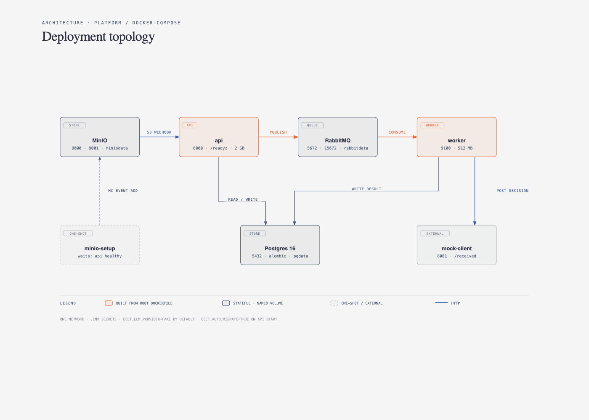
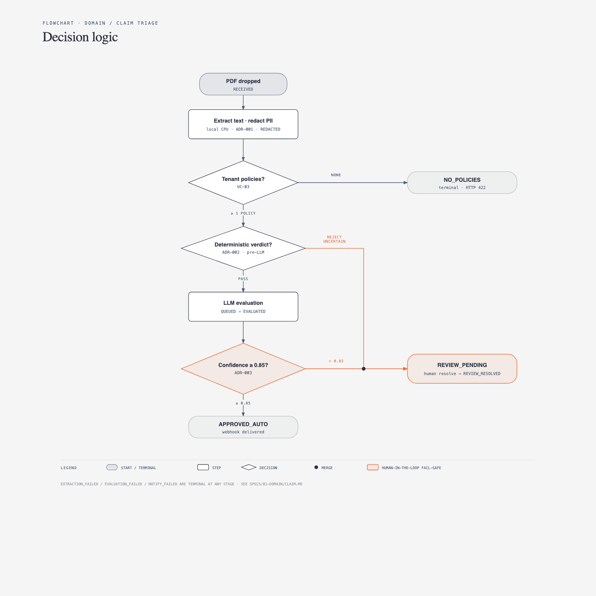

# Enterprise Claims Extraction & Triage Engine (ECET)

> A deterministic-first AI pipeline designed to extract clinical medical necessity from unformatted claim text, isolate tenant data, and run evaluation guardrails.

## 1. The Business Problem

Enterprise healthcare administrators spend 18-25 minutes per claim manually
matching unstructured physician notes with ICD-10 diagnostic policies. ECET reduces
processing time by automating the process of review claims while strictly maintaining a human review fail-safe.

## 2. Architecture & Decision Flow

#### 2.1 Deployment & Integration Points



Services and wiring: [docker-compose spec](specs/05-platform/docker-compose.md), [config](specs/05-platform/config.md).

#### 2.2 Decision flow



See also the [claim lifecycle state machine](specs/01-domain/claim.md#2-state-machine).

### Key Architecture Decisions (ADRs)

- [ADR-001](specs/00-overview.md#4-adrs): PII redaction executes on local CPU before external LLM API calls. Specs: [UC-02 RedactPii](specs/02-use-cases/UC-02-redact-pii.md), [presidio adapter](specs/03-infrastructure/pii-redactor-presidio.md).
- [ADR-002](specs/00-overview.md#4-adrs): Hard deterministic validation checks execute prior to LLM calls in order to reduce API costs. Specs: [UC-04 RunDeterministicChecks](specs/02-use-cases/UC-04-run-deterministic-checks.md), [domain rules](specs/01-domain/evaluation.md#1-deterministicresult-adr-002).
- [ADR-003](specs/00-overview.md#4-adrs): Confidence scores < 0.85 force an immediate push to Human-in-the-Loop review. Specs: [UC-07 RouteDecision](specs/02-use-cases/UC-07-route-decision.md), [UC-09 HumanReview](specs/02-use-cases/UC-09-human-review.md).

Full ADR list (001–007) and the end-to-end flow: [specs/00-overview.md](specs/00-overview.md).

### Specs

| Spec                                                         | What's inside                                                                                            |
| ------------------------------------------------------------ | -------------------------------------------------------------------------------------------------------- |
| [System overview & index](specs/00-overview.md#5-spec-index) | End-to-end flow, the seven ADRs, and the index of every spec below.                                      |
| [Domain](specs/01-domain/claim.md)                           | Core model: claim + state machine, evaluation results, tenant policies.                                  |
| [Use cases](specs/02-use-cases/README.md)                    | UC-01…UC-09, one per pipeline step from document ingest to human review.                                 |
| [Infrastructure](specs/03-infrastructure/postgres.md)        | Adapter specs: Postgres, RabbitMQ, MinIO, PDF extractor, Presidio redactor, LLM gateway, webhook client. |
| [Interfaces](specs/04-interfaces/api.md)                     | Entry points: HTTP API surface and the queue worker.                                                     |
| [Platform](specs/05-platform/project-layout.md)              | Project layout, config, docker-compose, observability, testing strategy.                                 |
| [Roadmap](specs/06-roadmap.md)                               | Build order and what is deliberately out of scope.                                                       |

## 4. Quickstart (Under 2 Minutes)

Prerequisites: Python 3.12, [uv](https://docs.astral.sh/uv/), and Docker (with Compose).

```bash
git clone https://github.com/HarielGiacomuzzi/HealthcareTriageEngine.git
cd HealthcareTriageEngine

make install   # uv sync
make check     # lint, typecheck, import contracts, tests (or: make test)

make up        # copies .env.example -> .env, builds and starts the compose stack
curl -sf localhost:8000/healthz && echo

make down      # stop the stack
```
