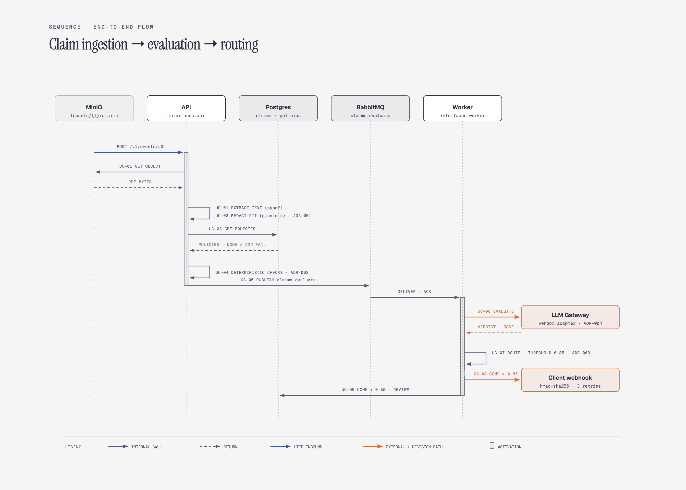

# ECET — System Overview & Spec Index

Enterprise Claims Extraction & Triage Engine. Deterministic-first AI pipeline:
PDF claim lands in tenant bucket → text extracted → PII redacted locally →
tenant policies attached → LLM evaluation via queue → confidence gate →
client webhook or human review.

## 1. Tech Stack (pinned)

| Concern           | Choice                                           | Version    |
| ----------------- | ------------------------------------------------ | ---------- |
| Language          | Python                                           | 3.12       |
| API               | FastAPI                                          | 0.141.x    |
| Models/validation | Pydantic                                         | 2.x        |
| Settings          | pydantic-settings                                | 2.x        |
| PII redaction     | presidio-analyzer + presidio-anonymizer          | 2.2.x      |
| NLP model         | spaCy `en_core_web_lg`                           | 3.x        |
| PDF text          | pypdf                                            | latest 4.x |
| Object storage    | MinIO (S3-compatible, webhook events)            | latest     |
| Relational DB     | PostgreSQL                                       | 16         |
| DB driver/ORM     | SQLAlchemy 2.x (async) + asyncpg                 | 2.x        |
| Migrations        | Alembic                                          | 1.x        |
| Queue             | RabbitMQ                                         | 3.13       |
| AMQP client       | aio-pika                                         | 9.x        |
| HTTP client       | httpx                                            | 0.27.x     |
| LLM vendor        | OpenAI-compatible SDK (behind gateway port)      | latest     |
| Packaging         | uv + pyproject.toml                              | —          |
| Tests             | pytest, pytest-asyncio, testcontainers           | —          |
| Lint/type         | ruff, mypy (strict on `domain/`, `application/`) | —          |

## 2. Architecture (CLEAN)

```
src/ecet/
  domain/          # entities, value objects, domain errors, repository ports. Zero deps.
  application/     # use cases (one class per use case), DTOs, service ports (LLM, queue, webhook)
  infrastructure/  # adapters: postgres, rabbitmq, minio/s3, presidio, pypdf, openai, httpx
  interfaces/      # FastAPI app (HTTP in), worker (AMQP in)
  config.py        # pydantic-settings
```

Dependency rule: `interfaces → application → domain`, `infrastructure → application/domain`.
Nothing in `domain/` or `application/` imports FastAPI, SQLAlchemy, presidio, boto, pika.
Ports are `typing.Protocol` classes. Wiring happens in `interfaces/*/container.py`.

Two deployables from one Docker image, selected by command:

- `ecet api` → FastAPI, receives S3 events, serves review/health endpoints.
- `ecet worker` → RabbitMQ consumer, runs LLM evaluation + routing.

## 3. End-to-end Flow

```
[MinIO bucket: put tenants/{tenant}/claims/{claim}.pdf]
        │ bucket notification (webhook)
        ▼
POST /v1/events/s3  (interfaces.api)
        │  UC-01 IngestClaimDocument
        ├─ download object, extract text (pypdf)
        ├─ UC-02 RedactPii (presidio, local CPU)          ADR-001
        ├─ UC-03 AttachTenantPolicies (postgres)  ── none → FAIL claim, 422
        ├─ UC-04 RunDeterministicChecks                   ADR-002
        └─ UC-05 EnqueueEvaluation (rabbitmq: claims.evaluate)
                                    │
                                    ▼
                  worker consumer (interfaces.worker)
                    UC-06 EvaluateClaim (LLMGateway → vendor adapter)
                    UC-07 RouteDecision:
                       confidence ≥ 0.85 → UC-08 NotifyClient (webhook)   ADR-003
                       confidence < 0.85 → UC-09 RequestHumanReview
```



Each step above is specified in [`02-use-cases/`](02-use-cases/README.md):

| Use case                                                                       | What it does                                                                                |
| ------------------------------------------------------------------------------ | ------------------------------------------------------------------------------------------- |
| [UC-01 IngestClaimDocument](02-use-cases/UC-01-ingest-claim-document.md)       | Turns an S3 object event into a persisted claim and a queued evaluation, idempotently.      |
| [UC-02 RedactPii](02-use-cases/UC-02-redact-pii.md)                            | Strips PII from claim text locally before anything is stored or sent out.                   |
| [UC-03 AttachTenantPolicies](02-use-cases/UC-03-attach-tenant-policies.md)     | Loads the tenant's active policies; none found is a hard failure.                           |
| [UC-04 RunDeterministicChecks](02-use-cases/UC-04-run-deterministic-checks.md) | Cheap rule checks (ICD-10 format, code overlap, empty text) that can short-circuit the LLM. |
| [UC-05 EnqueueEvaluation](02-use-cases/UC-05-enqueue-evaluation.md)            | Publishes the redacted claim plus a policy snapshot to `claims.evaluate`.                   |
| [UC-06 EvaluateClaim](02-use-cases/UC-06-evaluate-claim.md)                    | Worker side: one message, one LLM call through the gateway, one decision.                   |
| [UC-07 RouteDecision](02-use-cases/UC-07-route-decision.md)                    | Routes on confidence: auto-notify at ≥ 0.85, human review below.                            |
| [UC-08 NotifyClient](02-use-cases/UC-08-notify-client.md)                      | Pushes the triage outcome to the tenant's webhook, with retries.                            |
| [UC-09 RequestHumanReview](02-use-cases/UC-09-human-review.md)                 | Creates, lists and resolves review tasks for low-confidence claims.                         |

Claim lifecycle state machine lives in [`01-domain/claim.md`](01-domain/claim.md#2-state-machine).

## 4. Architecture Decision Records

- ADR-001 PII redaction on local CPU before any external call. Raw text never leaves process; only redacted text persisted/queued. Specs: [UC-02](02-use-cases/UC-02-redact-pii.md), [pii-redactor-presidio.md](03-infrastructure/pii-redactor-presidio.md).
- ADR-002 Deterministic checks before LLM. Cheap rules (ICD-10 format, policy code overlap, empty text) short-circuit; skipped LLM call = cost saving. Specs: [UC-04](02-use-cases/UC-04-run-deterministic-checks.md), [evaluation.md §1](01-domain/evaluation.md#1-deterministicresult-adr-002).
- ADR-003 Confidence < 0.85 → human review. Threshold configurable (`ECET_CONFIDENCE_THRESHOLD`), default 0.85. Specs: [UC-07](02-use-cases/UC-07-route-decision.md), [evaluation.md §3](01-domain/evaluation.md#3-triagedecision-pure-function-adr-003).
- ADR-004 Vendor-agnostic LLM gateway. `application/ports/llm_gateway.py` Protocol; adapters per vendor; fake adapter for tests. Specs: [llm-gateway.md](03-infrastructure/llm-gateway.md).
- ADR-005 Missing tenant policies = hard failure at ingestion. No LLM call without policy context. Specs: [UC-03](02-use-cases/UC-03-attach-tenant-policies.md), [policy.md](01-domain/policy.md#3-repository-port-ecetdomainportspolicy_repositorypy).
- ADR-006 Idempotency by S3 object (bucket, key, etag). Duplicate event = no-op 200. Specs: [UC-01](02-use-cases/UC-01-ingest-claim-document.md), [postgres.md](03-infrastructure/postgres.md#schema).
- ADR-007 Single image, two entrypoints (api / worker). One build, one deploy artifact. Specs: [docker-compose.md](05-platform/docker-compose.md), [worker.md](04-interfaces/worker.md).

## 5. Spec Index

| Area           | Specs                                                                                                                                                                                                                                                                                                                                                                                                                                                                                                 |
| -------------- | ----------------------------------------------------------------------------------------------------------------------------------------------------------------------------------------------------------------------------------------------------------------------------------------------------------------------------------------------------------------------------------------------------------------------------------------------------------------------------------------------------- |
| Domain         | [claim](01-domain/claim.md) · [policy](01-domain/policy.md) · [evaluation](01-domain/evaluation.md) · [tenant](01-domain/tenant.md)                                                                                                                                                                                                                                                                                                                                                                   |
| Use cases      | [index](02-use-cases/README.md) · [UC-01](02-use-cases/UC-01-ingest-claim-document.md) · [UC-02](02-use-cases/UC-02-redact-pii.md) · [UC-03](02-use-cases/UC-03-attach-tenant-policies.md) · [UC-04](02-use-cases/UC-04-run-deterministic-checks.md) · [UC-05](02-use-cases/UC-05-enqueue-evaluation.md) · [UC-06](02-use-cases/UC-06-evaluate-claim.md) · [UC-07](02-use-cases/UC-07-route-decision.md) · [UC-08](02-use-cases/UC-08-notify-client.md) · [UC-09](02-use-cases/UC-09-human-review.md) |
| Infrastructure | [object-storage-minio](03-infrastructure/object-storage-minio.md) · [pdf-text-extractor](03-infrastructure/pdf-text-extractor.md) · [pii-redactor-presidio](03-infrastructure/pii-redactor-presidio.md) · [postgres](03-infrastructure/postgres.md) · [queue-rabbitmq](03-infrastructure/queue-rabbitmq.md) · [llm-gateway](03-infrastructure/llm-gateway.md) · [webhook-client](03-infrastructure/webhook-client.md)                                                                                 |
| Interfaces     | [api](04-interfaces/api.md) · [worker](04-interfaces/worker.md)                                                                                                                                                                                                                                                                                                                                                                                                                                       |
| Platform       | [project-layout](05-platform/project-layout.md) · [docker-compose](05-platform/docker-compose.md) · [config](05-platform/config.md) · [observability](05-platform/observability.md) · [testing](05-platform/testing.md)                                                                                                                                                                                                                                                                               |
| Roadmap        | [06-roadmap.md](06-roadmap.md)                                                                                                                                                                                                                                                                                                                                                                                                                                                                        |

## 6. V1 Proof of Concept Assumptions

1. MinIO emulates S3 (native webhook notifications; LocalStack cannot POST HTTP directly).
2. Tenant resolved from object key prefix `tenants/{tenant_id}/claims/{file}.pdf`.
3. Text-based PDFs only. No OCR in v1 (scanned PDF → `EXTRACTION_FAILED`).
4. English clinical text (spaCy `en_core_web_lg`).
5. Human review = DB-backed queue + REST endpoints. No UI in v1.
6. Client webhook is HMAC-SHA256 signed POST, 3 retries with backoff, then `NOTIFY_FAILED` state.
7. One generic OpenAI-compatible adapter (base URL + key + model) is the only real vendor adapter;
   any compliant server — Anthropic's compat endpoint, OpenAI, Azure, vLLM, Ollama — plugs in by config.
