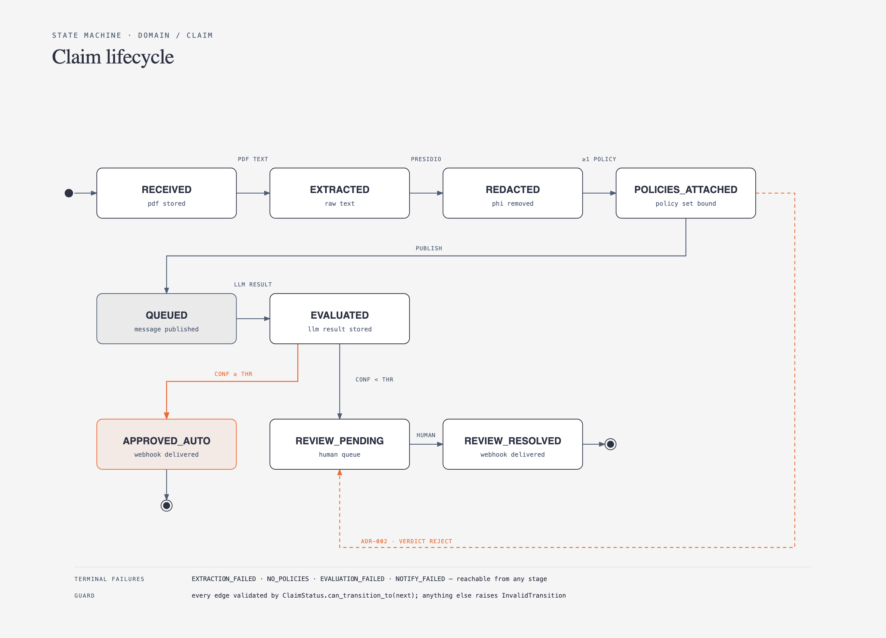

# Domain: Claim

Module: `ecet/domain/claim.py`. Pure Pydantic v2 models, no I/O.

## 1. Entities & Value Objects

### `ClaimId` (value object)

- `NewType("ClaimId", UUID)`. Generated at ingestion (`uuid4`).

### `SourceObject` (value object, frozen)

| Field  | Type | Notes                                              |
| ------ | ---- | -------------------------------------------------- |
| bucket | str  | non-empty                                          |
| key    | str  | must match `tenants/{tenant_id}/claims/{name}.pdf` |
| etag   | str  | S3 ETag, used for idempotency                      |
| size   | int  | > 0, ≤ `max_pdf_bytes` (config, default 20 MB)     |

Method: `tenant_id() -> TenantId` parses prefix. Invalid key → `InvalidObjectKey` error.

### `RedactedText` (value object, frozen)

| Field         | Type           |
| ------------- | -------------- | ------------------------------------ |
| text          | str            |
| entity_counts | dict[str, int] | e.g. `{"PERSON": 3, "DATE_TIME": 2}` |
| redactor      | str            | `"presidio-2.2.x"` for audit         |

Invariant: raw (pre-redaction) text is **never** a field on any persisted entity ([ADR-001](../00-overview.md#4-adrs)).

### `Claim` (aggregate root)

| Field                 | Type                        | Notes                                                                                            |
| --------------------- | --------------------------- | ------------------------------------------------------------------------------------------------ |
| id                    | ClaimId                     |                                                                                                  |
| tenant_id             | TenantId                    | see [`tenant.md`](tenant.md)                                                                     |
| source                | SourceObject                |                                                                                                  |
| status                | ClaimStatus                 | see [state machine](#2-state-machine)                                                            |
| redacted              | RedactedText \| None        | set after [UC-02](../02-use-cases/UC-02-redact-pii.md)                                           |
| policy_ids            | list[PolicyId]              | set after [UC-03](../02-use-cases/UC-03-attach-tenant-policies.md); see [`policy.md`](policy.md) |
| deterministic         | DeterministicResult \| None | see [`evaluation.md`](evaluation.md#1-deterministicresult-adr-002)                               |
| evaluation            | Evaluation \| None          | see [`evaluation.md`](evaluation.md#2-evaluation-llm-output-vendor-neutral)                      |
| failure_reason        | str \| None                 | set with FAILED states                                                                           |
| notification_attempts | int                         | default 0; incremented by [UC-08](../02-use-cases/UC-08-notify-client.md)                        |
| last_notify_error     | str \| None                 | last webhook failure detail                                                                      |
| created_at            | datetime (UTC)              |                                                                                                  |
| updated_at            | datetime (UTC)              |                                                                                                  |

## 2. State Machine

<details>
<summary>State list (text)</summary>

```
RECEIVED
  → EXTRACTED            (text pulled from PDF)
  → REDACTED             (presidio done)
  → POLICIES_ATTACHED    (≥1 policy found)
  → QUEUED               (message published)
  → EVALUATED            (LLM result stored)
  → APPROVED_AUTO        (confidence ≥ threshold, webhook delivered)
  → REVIEW_PENDING       (confidence < threshold OR deterministic REJECT/UNCERTAIN)
  → REVIEW_RESOLVED      (human decided; webhook delivered)

Terminal failure states (any stage):
  EXTRACTION_FAILED, NO_POLICIES, EVALUATION_FAILED, NOTIFY_FAILED
```

</details>



Allowed transitions encoded in `ClaimStatus.can_transition_to(next)`.
`Claim.transition(next, *, reason=None)` raises `InvalidTransition` otherwise.
Every transition bumps `updated_at`.

Deterministic short-circuit ([ADR-002](../00-overview.md#4-adrs)): if `DeterministicResult.verdict == REJECT`,
claim goes `POLICIES_ATTACHED → REVIEW_PENDING` directly, skipping QUEUED/EVALUATED.

## 3. Domain Errors (`ecet/domain/errors.py`)

All subclass `DomainError(Exception)`:

- `InvalidObjectKey`
- `InvalidTransition`
- `PdfTooLarge`
- `NoPoliciesForTenant` (raised by UC-03, maps to HTTP 422)
- `ClaimNotFound`

Persisted by the [postgres adapter](../03-infrastructure/postgres.md#schema).

## 4. Repository Port (`ecet/domain/ports/claim_repository.py`)

```python
class ClaimRepository(Protocol):
    async def add(self, claim: Claim) -> None: ...
    async def get(self, claim_id: ClaimId) -> Claim: ...            # raises ClaimNotFound
    async def find_by_source(self, bucket: str, key: str, etag: str) -> Claim | None: ...
    async def save(self, claim: Claim) -> None: ...                   # full overwrite, optimistic on updated_at
    async def list_by_status(self, status: ClaimStatus, *, limit: int = 50) -> list[Claim]: ...
```

## 5. Tests (domain level, no I/O)

- Key parsing valid/invalid.
- Every legal transition passes; illegal raises.
- `Claim` JSON round-trip (`model_dump` / `model_validate`) stable.
- Size invariant enforced.
