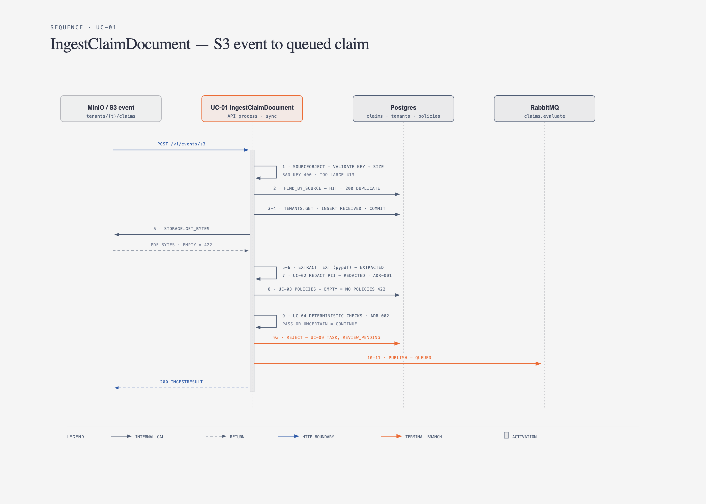

# UC-01 IngestClaimDocument

Orchestrates ingestion from S3 event to queue. Runs in API process, synchronous
within request (target p95 < 1.5 s for 5-page PDF, [README goal](../../README.md#1-the-business-problem)).

## Input

```python
class IngestCommand(BaseModel):
    bucket: str
    key: str
    etag: str
    size: int
```

## Output

```python
class IngestResult(BaseModel):
    claim_id: ClaimId
    status: ClaimStatus          # QUEUED | REVIEW_PENDING | duplicate original status
    duplicate: bool = False
```

## Dependencies

`UnitOfWork` (claims, tenants, policies, review_tasks), `ObjectStorage`,
`TextExtractor`, `RedactPii` ([UC-02](UC-02-redact-pii.md)), `AttachTenantPolicies` ([UC-03](UC-03-attach-tenant-policies.md)),
`RunDeterministicChecks` ([UC-04](UC-04-run-deterministic-checks.md)), `EnqueueEvaluation` ([UC-05](UC-05-enqueue-evaluation.md)),
`RequestHumanReview` ([UC-09](UC-09-human-review.md)), `Clock`.

## Steps



<details>
<summary>Step-by-step (text)</summary>

1. Build `SourceObject` (validates key, size). Invalid → `InvalidObjectKey` / `PdfTooLarge`.
2. Idempotency: `claims.find_by_source(bucket, key, etag)` → exists → return `duplicate=True` ([ADR-006](../00-overview.md#4-adrs)).
3. `tenants.get(tenant_id)` → missing/inactive → `TenantNotFound`.
4. Create `Claim(status=RECEIVED)`, `claims.add`. Commit. (claim exists even if later steps fail → auditable.)
5. `storage.get_bytes` → `extractor.extract`. Empty/exception → transition `EXTRACTION_FAILED`, save, raise `ExtractionFailed`.
6. Transition `EXTRACTED`.
7. UC-02 → `claim.redacted`, transition `REDACTED`. Raw text variable dropped here; never persisted.
8. UC-03 → `claim.policy_ids`, transition `POLICIES_ATTACHED`. `NoPoliciesForTenant` → transition `NO_POLICIES`, save, re-raise.
9. UC-04 → `claim.deterministic`.
   - `REJECT` → UC-09 with reason `DETERMINISTIC_REJECT`, transition `REVIEW_PENDING`. Skip queue.
   - `PASS` / `UNCERTAIN` → continue.
10. UC-05 publish. Transition `QUEUED`.
11. Save, commit, return.

</details>

Steps 5–11 wrapped so any unexpected exception sets failure state + reason before re-raising.
Publish (step 10) happens **after** DB commit of `POLICIES_ATTACHED`; if publish fails, status stays `POLICIES_ATTACHED` and a retry endpoint / sweeper can re-publish (outbox pattern deferred, see [roadmap](../06-roadmap.md#deferred-explicitly-out-of-v1)).

## Errors → HTTP (mapped in [interfaces](../04-interfaces/api.md#error-mapping-errorspy))

| Error               | HTTP |
| ------------------- | ---- |
| InvalidObjectKey    | 400  |
| PdfTooLarge         | 413  |
| TenantNotFound      | 404  |
| ExtractionFailed    | 422  |
| NoPoliciesForTenant | 422  |
| duplicate           | 200  |

## Tests

- Happy path → QUEUED, one publish call, claim persisted with redacted text only.
- Duplicate etag → no side effects.
- Tenant with no policies → NO_POLICIES persisted, 422.
- Deterministic REJECT → REVIEW_PENDING, zero publish calls.
- Extraction raises → EXTRACTION_FAILED persisted.
- Assert raw text absent from every `claims.save` argument (regex on known PII fixture).
